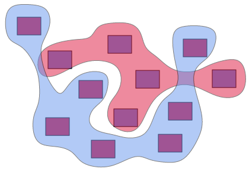

BubbleSets for JavaScript
=========================

A JavaScript implementation of Christopher Collins' [bubble sets](http://vialab.science.uoit.ca/portfolio/bubblesets)
without the use of external libraries. A Java implementation can be found [here](https://github.com/JosuaKrause/Bubble-Sets).

[](https://bubblesets-js.josuakrause.com/)

Usage:

```shell
npm i bubblesets
```

and

```javascript
import {
  BSplineShapeGenerator,
  BubbleSet,
  PointPath,
  ShapeSimplifier,
} from './bubblesets.js';

const pad = 5;
// bubbles can be reused for subsequent runs or different sets of rectangles
const bubbles = new BubbleSet();
// rectangles needs to be a list of objects of the form { x: 0, y: 0, width: 0, height: 0 }
// lines needs to be a list of objects of the form { x1: 0, x2: 0, y1: 0, y2: 0 }
// lines can be null to infer lines between rectangles automatically
const list = bubbles.createOutline(
  BubbleSet.addPadding(rectangles, pad),
  BubbleSet.addPadding(otherRectangles, pad),
  null /* lines */
);
// outline is a path that can be used for the attribute d of a SVG path element
const outline = new PointPath(list).transform([
  new ShapeSimplifier(0.0),  // removes path points by removing (near) colinear points
  new BSplineShapeGenerator(),  // smoothes the output shape using b-splines
  new ShapeSimplifier(0.0),  // removes path points by removing (near) colinear points
]);
path.setAttribute('d', `${outline}`);
```

See also the [demo](https://bubblesets-js.josuakrause.com/) (add rectangles by clicking with the left or right mouse button).

This implementation is based on the Java code originally written by Christopher Collins.
If you're missing a feature from the Java version or find a bug please open an [issue](https://github.com/JosuaKrause/bubblesets-js/issues/new). [Pull requests](https://github.com/JosuaKrause/bubblesets-js/compare) are also welcome.
